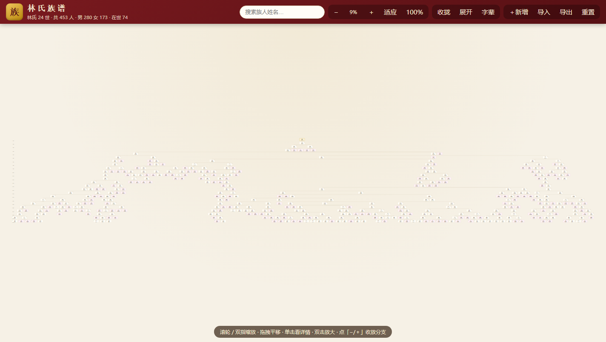

# Lin Family Tree · 林氏族谱 — Genealogy Website

> **An open-source, offline-capable Chinese family tree (genealogy / 族谱) website** built with plain HTML/CSS/JavaScript — no frameworks, no third-party dependencies, no build step. Comes with a **24-generation, 453-person sample dataset**, a zoomable & pannable SVG tree diagram, JSON import/export, and full member management (add / edit / delete with confirmation).

[简体中文](README.md) | **English**



## Highlights

- **24 generations (世) of sample data** — 453 people spanning from 1380 (Ming Dynasty) to today, generated by a fixed-seed generator so the demo is always reproducible
- **Zoom & pan** — mouse wheel, two-finger pinch, double-click / double-tap, toolbar buttons, 100% reset, one-click fit-to-screen
- **Search & locate** — type a name to find anyone, jump & highlight instantly
- **Detail panel** — birth/death years, lifespan, generation character (字辈), father, spouse, children (clickable), biography notes
- **Branch management** — collapse/expand any branch with −/+ buttons, "focus branch" mode, collapse-all / expand-all
- **Highlight lineage** — selecting a person dims unrelated nodes so ancestors & descendants stand out
- **Data management**:
  - **Add members** — toolbar "＋Add" (pick the father), or "Add child" from the detail panel
  - **Edit members** — name, gender, birth/death year, spouse, notes
  - **Delete members** — a **confirmation dialog** warns how many descendants will be removed and that the action is irreversible
  - **Export JSON** — download a `.json` file or copy to clipboard
  - **Import JSON** — accepts the app's export format, a plain array `[{...}]`, or a nested tree `{root:{...}}`; data is validated (single founder, no cyclic references, valid fields) and bad input is rejected without touching current data
  - **Reset** — restore the built-in sample data with one click
- **Mobile friendly** — responsive layout; the detail panel and dialogs become bottom sheets on phones
- **Zero dependencies, works offline** — just open `index.html` directly in a browser, or serve it with any static server

## Getting Started

**Option A (recommended):** double-click `index.html` and open it in a browser.

**Option B:** run the bundled zero-dependency static server:

```bash
node server.js
# then open http://127.0.0.1:8090/
```

## Keyboard Shortcuts

| Key | Action |
| --- | --- |
| `+` / `-` | Zoom in / out |
| `0` | Fit entire tree |
| `Esc` | Close the detail panel / dialog |

## JSON Data Format

The export file looks like this:

```json
{
  "format": "family-tree",
  "version": 1,
  "surname": "Lin",
  "poem": "承先启后德泽绵长忠孝传家诗书继世光耀门楣万代流芳",
  "persons": [
    {
      "id": 1,
      "name": "林承X",
      "gender": "M",
      "gen": 1,
      "birthYear": 1380,
      "deathYear": 1442,
      "fatherId": null,
      "spouse": "配 李氏",
      "marriedTo": null,
      "note": "Founder…",
      "isFounder": true
    }
  ]
}
```

Import also accepts a **plain array** `[{...}]` (reference the father via `fatherId`; `id` is optional and assigned automatically) or a **nested tree** `{ "root": { "name": "...", "children": [...] } }`.

## Project Structure

```
family_tree/
├── index.html          # Page shell
├── css/style.css       # Styles (Chinese aesthetic + responsive + modals/forms)
├── js/data.js          # Sample data generator (fixed seed, reproducible)
├── js/tidy-tree.js     # Tidy tree layout algorithm (Buchheim, verified identical to d3-hierarchy)
├── js/store.js         # Data store: CRUD, import/export, validation
├── js/editor.js        # Modal UI: forms, delete confirmation, import/export dialogs
├── js/app.js           # Rendering, zoom/pan, search, details, collapse interactions
├── server.js           # Minimal static server (no dependencies)
├── shots/              # Screenshots
└── tests/              # Unit tests & browser smoke tests
```

## Using Your Own Genealogy Data

- **Recommended:** click "Import" on the page and load your own JSON file.
- Or edit `js/data.js` — change `SURNAME`, `POEM` (one character per generation), `FOUNDER_YEAR`, and `DEFAULT_SEED` to generate a different sample family.

## Tests

```bash
node tests/layout.test.js     # Layout correctness (30 random seeds: ≥18 generations, no same-generation overlap)
node tests/store.test.js      # Data-store unit tests (CRUD / import-export / bad-data protection)
node tests/d3-compare.mjs     # Layout compared point-by-point against official d3-hierarchy
node tests/smoke.mjs          # Browser interaction smoke test (start `node server.js` first)
```

## License

Feel free to use, modify and share this project for personal or commercial purposes.
