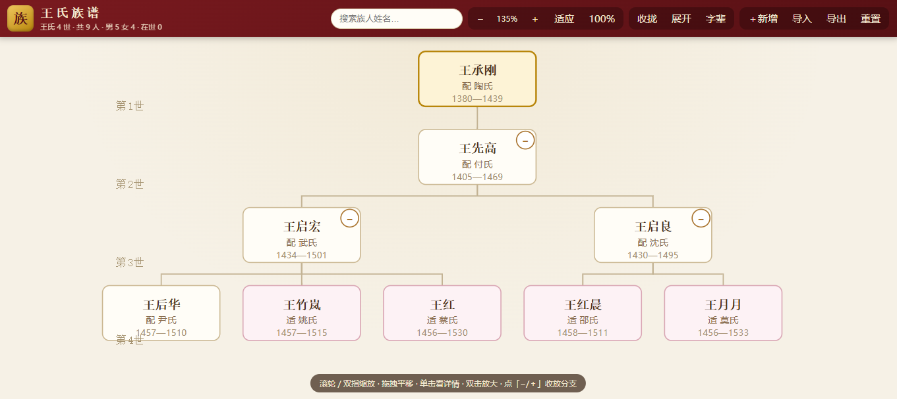

# 王氏族谱网站 · 族谱 / 家谱 / Family Tree / Genealogy

**简体中文** | [English](README.en.md)

> **开源、免费、离线可用的中文族谱（家谱）在线网站**：内置 **24 世（代）、453 人**示例族谱数据，采用 SVG 绘制世系树状图，支持**缩放平移、姓名搜索定位、分支折叠、只看此支**；数据以 **JSON** 格式**导入导出**，可在页面直接**新增、编辑、删除**成员（删除带**二次确认**）。纯 HTML/CSS/JavaScript 实现，**零框架、零第三方依赖、无需构建**，双击 `index.html` 即可使用，兼容手机浏览。



## 功能

- **24 世示例族谱**：字辈诗「承先启后 · 德泽绵长 · 忠孝传家 · 诗书继世 · 光耀门楣 · 万代流芳」，始祖生于明洪武年间（1380 年），历代延续至今
- **放大 / 缩小**：滚轮缩放、双指捏合、双击（双点）放大、按钮缩放、100% 还原、一键适应全屏
- **平移**：鼠标拖拽 / 单指拖动
- **搜索定位**：按姓名搜索族人，一键居中并高亮
- **详情面板**：生卒年份、享年、字辈、父亲、配偶 / 婚配、子女列表（可点击跳转）、生平备注
- **分支管理**：每个节点可「−/＋」折叠、展开该支；「只看此支」只显示某人的祖先链及其后代；一键收拢 / 展开全部
- **选中高亮**：点击人物后，其余无关节点自动变淡，突出该人的祖先与后代脉络
- **数据管理**：
  - **新增成员**：顶部「＋新增」（选择父亲挂靠），或详情面板「添加子女」快速录入
  - **编辑成员**：详情面板「编辑」，可改姓名、性别、生卒年、配偶、备注
  - **删除成员**：详情面板「删除」，弹出**二次确认框**（提示连同后裔人数、不可恢复），确认后才执行
  - **导出 JSON**：下载 `.json` 文件或复制到剪贴板，完整保留全部数据
  - **导入 JSON**：支持本页导出格式、人员数组、树形嵌套三种格式；导入前校验（始祖唯一、无循环引用、字段合法），出错自动拒绝且不破坏现有数据
  - **重置**：一键恢复为内置示例数据
- **字辈诗**：顶部「字辈」按钮查看全诗
- **响应式**：手机端顶部栏自动紧凑排布，详情面板与弹窗变为底部抽屉

## JSON 数据格式

导出文件形如：

```json
{
  "format": "family-tree",
  "version": 1,
  "surname": "王",
  "poem": "承先启后德泽绵长忠孝传家诗书继世光耀门楣万代流芳",
  "persons": [
    {
      "id": 1,
      "name": "王承X",
      "gender": "M",
      "gen": 1,
      "birthYear": 1380,
      "deathYear": 1442,
      "fatherId": null,
      "spouse": "配 李氏",
      "marriedTo": null,
      "note": "始迁祖…",
      "isFounder": true
    }
  ]
}
```

导入时也接受**人员数组** `[{...}]`（`fatherId` 引用父节点 id，id 可省略自动分配）或**树形嵌套** `{ "root": { "name": "...", "children": [...] } }`。

## 运行

方式一（推荐）：直接双击 `index.html` 用浏览器打开。

方式二：启动本地服务器

```bash
node server.js
# 打开 http://127.0.0.1:8090/
```

## 键盘快捷键

| 按键 | 功能 |
| ---- | ---- |
| `+` / `-` | 放大 / 缩小 |
| `0` | 适应全屏 |
| `Esc` | 关闭详情面板 |

## 目录结构

```
family_tree/
├── index.html          # 页面骨架
├── css/style.css       # 样式（中国风 + 响应式 + 弹窗/表单）
├── js/data.js          # 示例数据生成器（固定种子，可复现）
├── js/tidy-tree.js     # 整洁树布局算法（Buchheim，已验证与 d3 一致）
├── js/store.js         # 数据仓库：增删改查、导入导出、校验
├── js/editor.js        # 表单 / 二次确认 / 导入导出弹窗 UI
├── js/app.js           # 渲染、缩放平移、搜索、详情、折叠等交互
├── server.js           # 简易静态服务器（无依赖）
├── README.md           # 中文说明
├── README.en.md        # English README
└── tests/              # 单元测试与浏览器冒烟测试
```

## 换成你自己的族谱数据

- 用页面上的「导入」直接加载你自己的 JSON（推荐）
- 或编辑 `js/data.js` 的 `SURNAME` / `POEM` / `FOUNDER_YEAR` / `DEFAULT_SEED` 生成不同示例


### 仓库简介

**中文**：开源中文族谱（家谱）网站：24 世示例数据，SVG 世系树支持缩放平移、搜索定位、分支折叠，JSON 导入导出，成员增删改（删除二次确认），兼容手机，纯静态零依赖。

**English**：Open-source Chinese family tree (genealogy) website: 24-generation sample data, zoomable SVG tree, search, JSON import/export, add/edit/delete members with confirmation, mobile-friendly, zero-dependency static site.

### 推荐标签（Topics / 关键词）

`family-tree` `genealogy` `族谱` `家谱` `chinese` `svg` `tree-layout` `json` `import-export` `crud` `mobile-friendly` `static-site` `zero-dependency` `web-app`

## 测试

```bash
node tests/layout.test.js     # 布局正确性（30 个随机种子：≥18 代、同代不重叠等）
node tests/store.test.js      # 数据仓库单元测试（增删改 / 导入导出 / 坏数据防护）
node tests/d3-compare.mjs     # 与官方 d3-hierarchy 输出逐点比对
node tests/smoke.mjs          # 浏览器交互冒烟测试（需先启动 node server.js）
```
